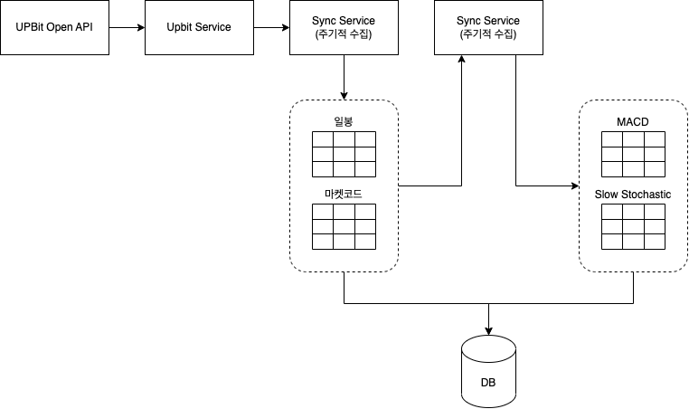

# Bitcoin-Trading-System

> Open API를 통해 Bitcoin 정보를 수집하고 분석하여 다양한 지표로 보여주고 나아가 자동으로 특정 포인트에 매수 또는 매도할 수 있도록한는 시스템이다. 다양한 전략을 구현할 수 있도록 유연한 설계를 목표로 한다.

## Overview

Upbit의 Open API를 이용하여 Candle정보를 수집하여 Database저장하고 이를 분석하여 보조 지표를 생성한다. 위 내용을 바탕으로 매매전략을 만들수 있고 Upbit Open API를 통해 자동으로 매매를 할 수 있다.

### 수집 및 분석 과정

1. Upbit Service를 통해 Upbit의 데이터를 수집하여 Sync Service에서 DB에 저장한다.

2. 일봉, 분봉, 마켓 코드 등 베이스 데이터를 모두 수집하면 Sync Service에서 MACD, Slow Stochastic등 보조지표를 생성하고 저장한다.

### 전략 구현

매수 또는 매도를 위해 필요한 전략을 추상화하여 매수 조건과 매도 조건을 확인 할 수 있어야한다.

또한 backtesting을 통해 저장되어있는 Candle에 적용하여 언제 매수가 일어나고 언제 매도가 일어나는지 확인해 볼 수 있다.

##### 변동성 돌파 전략

변동성 돌파 전략은 거래일의 현재가가 (시가 + 전일 변동폭 * K)를 돌파할 때 매수하고 금일 종가 또는 명일 시가에 매도하는 전략이다.

**매수 조건**

현재가가 (시가 + 전일 변동폭 * K)를 돌파하는지 확인한다.

**매도 조건**

현재 날짜와 시간이 매수한 날짜 다음날인지 확인한다.

백테스팅

주어진 기간동안 저가, 고가 사이에 조건을 만족하면 매수를 기록하고, 매수한 기록이 있다면 다음날 매도를 기록한다.

### 수집

Upbit의 API를 이용해 일봉, 분봉, 마켓 코드를 수집한다.

- https://github.com/Yun-SeYeong/Bitcoin-Trading-System/issues/4
- https://github.com/Yun-SeYeong/Bitcoin-Trading-System/issues/5
- https://github.com/Yun-SeYeong/Bitcoin-Trading-System/issues/6

### 조회

수집된 일봉, 분봉, 마켓 코드를 조회한다.

- https://github.com/Yun-SeYeong/Bitcoin-Trading-System/issues/16
- https://github.com/Yun-SeYeong/Bitcoin-Trading-System/issues/2
- https://github.com/Yun-SeYeong/Bitcoin-Trading-System/issues/1

### 분석

Sync된 정보를 바탕으로 보조 지표를 만든다.

- https://github.com/Yun-SeYeong/Bitcoin-Trading-System/issues/15
- https://github.com/Yun-SeYeong/Bitcoin-Trading-System/issues/14
